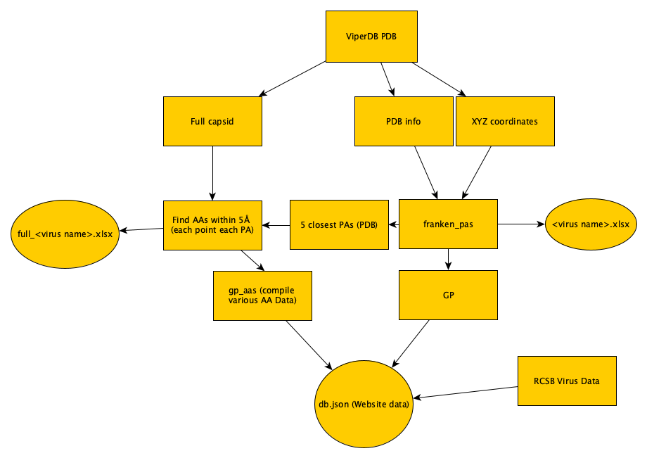

compare_db.json writes closest aas from rmids_full/pa-data-separate-chainupdate to db.json
get_gps reads db.json and writes to pa-data-gauge
clean_genomes reads pa-data-gauge and writes to pa-data-genome-full / pa-data-genome-exc.json
aa_counts reads pa-data-genome-full / pa-data-genome-exc and writes to pa-data-common.json
gp_aas reads pa-data-common and writes to pa-data-close.json / pa-data-dclosest.json / pa-data-gp-aas.json
OLD: assign-closest reads pa-data-common and writes to pa-data-final.json
properties reads pa-data-dclosest and writes to pa-data-properties.json
filters reads pa-data-properties and writes to pa-data-filters.json
gp_all_aas reads pa-data-filters and writes to pa-data-all-pas

---------------
# Data pipeline

-------------
closest_gp_aa: The AA with lowest distance from line 1 of excel file created from find_aas with the first PA in franken
output

Other AA data: 
most_common_aa: The most frequent AA in the full capsid
other_gp_aa: Another AA which was within 5 Angstroms of closest_gp_aa (NA if none)
closest_aa: The AA with lowest distance from any point in any PA
other_aa: Another AA which was within 5 Angstroms of closest_aa (NA if none)
common_gauge_aa: The most common AA from those with distance less than 5 (even if not closest - including other_aa_) from any point from the PA of first row of franken output

AAs contains full capsid AA counts for each virus
close_aas contains the pool from which common_gauge_aa is chosen 

analyze_uniq.ipynb contains analysis stuff for AA data
custom_pa.ipynb contains analysis stuff for PAs and correlations with other data

TODO: 
Account for blank fields

